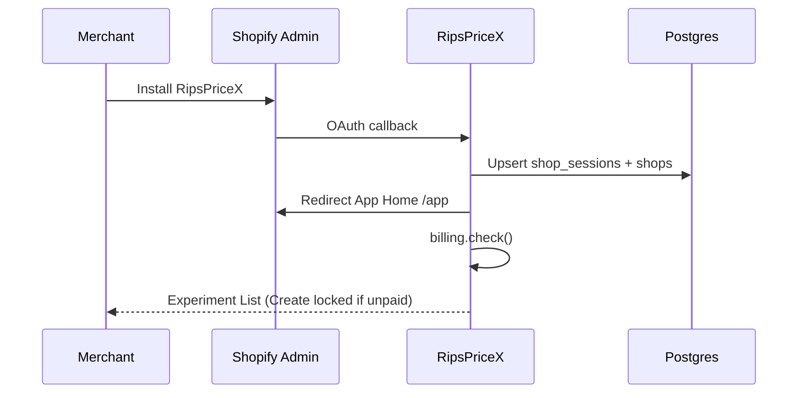
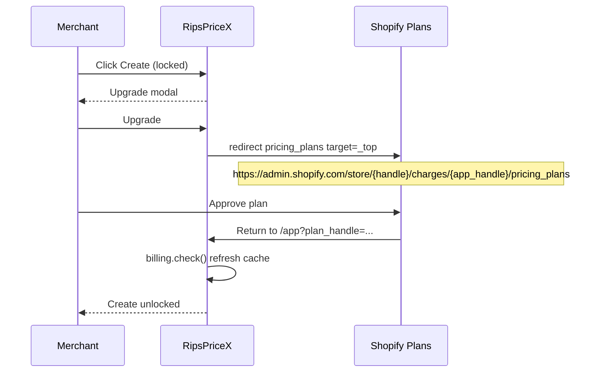

# RipsPriceX — Perfect Extraction & Implementation Plan

**Status:** Blueprint retained for history + phase checklist. **Implementation has started** in this repo.  
**Canonical home:** this file in **RipsPriceX** (moved out of RipX `docs/research/`).  
**Blueprint date:** 2026-08-08 · **Living docs:** prefer sibling files in this folder  
**Source product (historical):** RipX  
**This product:** **RipsPriceX** — Shopify-only Smart Pricing (Classic)  
**Constraint:** RipX remains a separate product; continue research **here** under `docs/research/`.

### Where to go next (do not treat this file as the only source of truth)

| Need | Doc |
|------|-----|
| Research index | [README.md](./README.md) |
| Product decisions | [00_PRODUCT_BRIEF.md](./00_PRODUCT_BRIEF.md) |
| What exists today | [01_AS_BUILT_ARCHITECTURE.md](./01_AS_BUILT_ARCHITECTURE.md) |
| Parity gaps | [02_PARITY_MATRIX.md](./02_PARITY_MATRIX.md) |
| APIs / schema | [03_API_AND_DATA_MAP.md](./03_API_AND_DATA_MAP.md) |
| Merchant journeys | [04_MERCHANT_FLOWS.md](./04_MERCHANT_FLOWS.md) |
| Further research tracks | [05_FURTHER_RESEARCH_ROADMAP.md](./05_FURTHER_RESEARCH_ROADMAP.md) |
| Latest Classic/surfaces audit | [CLASSIC_FLOW_AND_PRICE_SURFACES_AUDIT.md](./CLASSIC_FLOW_AND_PRICE_SURFACES_AUDIT.md) |

---

## 0. One-sentence verdict

RipsPriceX must be a **new Shopify Partner app + new repo** that ports Classic Smart Pricing **and** the price-test runtime (storefront paint → cart transform → analytics → winner), **rewrites auth/billing** so Shopify shop identity + App Pricing replace RipX email login/Domains, and uses **Shopify Admin sidebar + main content** (App Bridge Nav) instead of RipX’s custom sidebar.

Copying only `frontend/.../SmartPricing` will not work.

---

## 1. Why a separate project (not a RipX flag)

| Approach | Verdict |
|----------|---------|
| Feature-flag Smart Pricing inside RipX | Rejected — client wants a Shopify-only SP product |
| New app listing reusing RipX codebase + hide other nav | Risky — multi-tenant auth, scopes, extensions, App Store review stay tangled |
| **New repo + new Partner app, extract SP stack** | **Recommended** — clean identity, minimal scopes, SP-only UX |

**RipX coexistence:**

| App | Role |
|-----|------|
| RipX | Keep all current features; no breaking extraction |
| RipsPriceX | New `client_id`, new DB, new extensions, SP-only |

Do **not** reuse RipX’s `client_id`, app proxy subpath `ripx`, or extension UIDs.

---

## 2. Product contract (client requirements → design)

| Requirement | Design |
|-------------|--------|
| After install → Experiment List | App Home = `/app` → Classic Experiment List |
| No separate login | Embedded session tokens only; shop = tenant |
| Purchased → create/manage | Entitlement from Shopify App Pricing |
| Not purchased → Create locked | UI lock + API `402`; CTA → Shopify plan selection (`_top`) |
| Shop identifies customer | `session.shop` primary key |
| Only SP components | Classic UI + price-test runtime + billing + minimal settings |

**Recommended entitlement UX (important refinement):**

- **Always** show Experiment List after install (even unpaid).
- Lock **Create** / **Launch** when `!hasActivePayment`.
- Do **not** force-redirect the whole app to pricing on every load (Shopify’s sample often does that). Force-redirect only when user clicks locked Create/Upgrade, so unpaid merchants can still open the app and understand the product.

**Shell UX (client requirement — critical):**

- **No RipX-style custom left sidebar** inside the app iframe.
- Important menus live in the **Shopify Admin left sidebar** (App Bridge App Nav / `NavMenu`).
- Every feature page opens in the **Shopify Admin main content area** (embedded app iframe) — same place Products, Orders, and other apps render.

---

## 3. Shopify Admin shell — native sidebar + main content (deep research)

This section answers: *how RipsPriceX feels like a Shopify app, not a RipX clone with its own chrome.*

### 3.1 How Shopify embeds apps (mental model)

```text
┌─────────────────────────────────────────────────────────────────┐
│ Shopify Admin (browser chrome)                                  │
│ ┌──────────────┬──────────────────────────────────────────────┐ │
│ │ Admin nav    │ App title bar (App Bridge TitleBar / s-page) │ │
│ │ (Home,       │  e.g. "Experiments" + [Create experiment]    │ │
│ │  Orders,     ├──────────────────────────────────────────────┤ │
│ │  Products…)  │                                              │ │
│ │              │   MAIN CONTENT = your app iframe             │ │
│ │ ───────────  │   (Experiment List / Create / Details / …)   │ │
│ │ RipsPriceX   │                                              │ │
│ │  · Experiments│                                              │ │
│ │  · Create*   │                                              │ │
│ │  · Setup     │                                              │ │
│ │  · Settings  │                                              │ │
│ └──────────────┴──────────────────────────────────────────────┘ │
└─────────────────────────────────────────────────────────────────┘
```

| Layer | Who owns it | What RipsPriceX does |
|-------|-------------|----------------------|
| Outer Shopify Admin nav | Shopify | App appears under Apps / pinned app name |
| **App sub-nav (left sidebar under app name)** | **App Bridge App Nav** | Declare menu links only — Shopify renders them |
| **Title bar** (above content) | **App Bridge TitleBar / Polaris `s-page`** | Page title, primary CTA, breadcrumbs |
| **Main content** | **Your React routes inside iframe** | All Smart Pricing screens |

References:
- [App nav (`s-app-nav`)](https://shopify.dev/docs/api/app-home/app-bridge-web-components/app-nav) — desktop left sidebar under the app; mobile = title-bar dropdown  
- [Title bar](https://shopify.dev/docs/api/app-home/app-bridge-web-components/title-bar) — native heading + actions  
- [App Bridge web components](https://shopify.dev/docs/api/app-home/app-bridge-web-components) — chrome outside the iframe  
- [React Router AppProvider + NavMenu](https://shopify.dev/docs/api/shopify-app-react-router/latest)

### 3.2 RipX today vs RipsPriceX target

| RipX today | RipsPriceX target |
|------------|-------------------|
| Custom `Sidebar.jsx` inside app (Dashboard, All Tests, Smart Pricing, Analytics, Settings, …) | **Delete custom sidebar entirely** |
| Smart Pricing is one item among many in RipX chrome | App **is** Smart Pricing — sidebar items are SP sections only |
| TopBar + domain switcher + email account shell | None — shop identity from Shopify session |
| Nested `/app/:domain/smart-pricing/*` | Flat `/app/*` routes inside Shopify content iframe |
| In-page Classic headers sometimes compete with app chrome | Prefer Shopify **TitleBar** for page title + Create CTA |

**Do not port:** `frontend/src/components/Layout/Sidebar.jsx`, `TopBar`, Domains shell, Admin layout.

### 3.3 Recommended Shopify sidebar information architecture

> **IA revision (2026-08-11):** Billing is no longer a top-level nav item. Plan lives under **Settings → Plan** (`?tab=plan`). Legacy `/app/billing` redirects there. Setup remains a first-class nav item (readiness checklist). Create wizard step 1 label is **Basics** (not “Setup”) to avoid colliding with nav Setup.

Shopify App Nav is **single-level only** (no nested submenu items). Keep the list short (Shopify guidance: concise nouns, most-used first).

| Sidebar label | Route | Role |
|---------------|-------|------|
| *(app name / Home)* | `/app` with `rel="home"` | **Experiment List** (default after install) — home link is hidden from menu; app name opens it |
| Experiments | `/app` *(or omit if home covers it)* | Same list — usually home is enough; optional duplicate only if you want a visible “Experiments” label |
| Create | `/app/experiments/new` | Create wizard (**lock when unpaid** — still show item; clicking opens upgrade modal or locked screen) |
| Setup | `/app/setup` | Theme embed + cart transform + checkout readiness checklist |
| Settings | `/app/settings` | Tabs: **Plan** · Guardrails · Installation · Price surfaces (default tab Guardrails when no `?tab=`) |

**Recommended MVP sidebar (visible items):**

```text
RipsPriceX
  Experiments     → /app                 (home)
  Create          → /app/experiments/new (gated)
  Setup           → /app/setup
  Settings        → /app/settings
```

**Not in sidebar** (open from list / title bar / in-page links — still inside Shopify main content):

- Experiment details `/app/experiments/:id` (with TitleBar breadcrumb → Experiments)
- Wizard steps (same Create route; step UI inside content)
- Winner apply modal (Polaris/App Bridge modal over content)
- Plan / upgrade chrome (`/app/settings?tab=plan`; legacy `/app/billing` redirects)

### 3.4 Implementation pattern (React Router template)

Root layout (`app/routes/app.tsx`) — **only** place that registers sidebar:

```tsx
import { NavMenu } from '@shopify/app-bridge-react';
import { Link, Outlet } from 'react-router';
import { AppProvider } from '@shopify/shopify-app-react-router/react';

export default function App() {
  return (
    <AppProvider embedded apiKey={apiKey}>
      <NavMenu>
        <Link to="/app" rel="home">Experiments</Link>
        <Link to="/app/experiments/new">Create</Link>
        <Link to="/app/setup">Setup</Link>
        <Link to="/app/settings">Settings</Link>
      </NavMenu>
      {/* NO custom <Sidebar /> */}
      <Outlet />  {/* ← all features render here = Shopify main content iframe */}
    </AppProvider>
  );
}
```

Equivalent web-component form:

```html
<s-app-nav>
  <s-link href="/app" rel="home">Experiments</s-link>
  <s-link href="/app/experiments/new">Create</s-link>
  <s-link href="/app/setup">Setup</s-link>
  <s-link href="/app/settings">Settings</s-link>
</s-app-nav>
```

**Rules:**

1. Every primary feature = a React Router child of `/app` → renders in `<Outlet />` → Shopify main content.  
2. Navigation uses App Bridge / React Router `Link` (same-origin relative paths) so admin chrome stays put — **no full admin page reloads**, no opening a separate RipX website.  
3. Active menu highlighting is automatic from URL (App Bridge 4).  
4. Max ~5–7 sidebar links; bury rare actions in TitleBar or page body.  
5. Locked Create: keep the nav item; destination shows locked state + Upgrade (or intercept click). Never hide the product’s main CTA entirely.

### 3.5 Title bar actions (Shopify chrome, not custom header)

Use native title bar for page-level CTAs so merchants recognize Shopify patterns:

| Page | TitleBar heading | Primary action | Secondary |
|------|------------------|----------------|-----------|
| Experiments | Experiments | Create experiment (locked → upgrade) | Filter is in-page |
| Create | New experiment | Launch / Save draft (step-aware) | Cancel → Experiments |
| Experiment detail | Experiment name | Pause / Resume / Apply winner | Breadcrumb → Experiments |
| Setup | Setup | — | — |
| Settings | Settings | Tab-aware (Save / Ensure / Upgrade) | Plan tab = Manage plan |

Example mental model for Experiment List:

```tsx
<TitleBar title="Experiments">
  <button variant="primary" onClick={onCreate}>Create experiment</button>
</TitleBar>
{/* list body fills main content */}
```

Or Polaris web components:

```html
<s-page heading="Experiments">
  <s-button slot="primary-action" …>Create experiment</s-button>
  …list…
</s-page>
```

### 3.6 What must NOT appear inside the iframe as “app chrome”

| Anti-pattern (RipX habit) | Why it fails Shopify UX |
|---------------------------|-------------------------|
| Full-height custom left sidebar | Doubles navigation; fights Admin sidebar |
| App logo + “Account / Domains” strip | Shopify already owns account/store context |
| Floating global TopBar with store switcher | Single-shop install; session is the store |
| Opening features in `target=_blank` or external marketing site | Breaks “inside Shopify” expectation |
| Nested in-app nav that duplicates App Nav | Confusing; keep one nav authority |

In-page UI is still allowed for **page content** (tables, wizard steps, tabs on experiment detail). Those are content, not global chrome.

### 3.7 Mobile behavior

On Shopify mobile Admin:
- App Nav items appear in a **dropdown from the title bar** (not a fake hamburger inside the iframe).
- Screens must remain usable full-width in the content area.
- Avoid relying on hover-only sidebar badges; use TitleBar badges / in-page banners for “needs setup”.

### 3.8 Client-facing UX statement (shareable)

> After installing RipsPriceX, merchants stay inside Shopify Admin. The left sidebar under the app name shows Experiments, Create, Setup, and Settings. Plan / upgrade lives under Settings → Plan. Clicking any item opens that screen in the main Shopify content area. There is no separate RipX login screen and no custom app sidebar — navigation is Shopify-native.

### 3.9 Acceptance criteria (shell)

- [ ] No custom left sidebar component shipped  
- [ ] Sidebar items appear under the app in Shopify Admin (desktop)  
- [ ] Clicking each item updates only the main content iframe  
- [ ] Install lands on Experiment List in main content  
- [ ] Create CTA available from TitleBar and/or sidebar; locked state prompts upgrade without leaving Admin (except plan page `_top` redirect)  
- [ ] Experiment detail uses breadcrumb back to Experiments in TitleBar  
- [ ] Works on Shopify Admin mobile via App Nav dropdown  

---

## 4. What Smart Pricing actually is in RipX

```text
Classic UI (inbox plans)
        │
        ▼
POST /api/smart-pricing/plans/launch
        │
        ▼
creates type:'price' test  ──►  tests / assignments / events
        │
        ▼
Theme embed → /apps/{proxy}/script.js → PDP paint
        │
        ▼
line attrs _ripx_* → cart transform → checkout money
        │
        ▼
analytics → stop → winner publish (write_products)
```

Smart Pricing = **inbox + plan UX** on top of **price A/B tests**. Extraction unit = both layers.

---

## 5. Recommended target architecture

### 5.1 Stack

| Layer | Choice | Why |
|-------|--------|-----|
| Scaffold | Shopify CLI + `@shopify/shopify-app-react-router` template | Official embedded auth, App Bridge, billing helpers |
| Admin UI | **Shopify App Nav sidebar + TitleBar**; Classic screens only in main content iframe; migrate body UI to Polaris incrementally | Native Admin UX (see §3) |
| API | Node services extracted from RipX Express (mount as React Router resource routes **or** sibling Express under same host) | Preserve battle-tested SP logic |
| DB | Dedicated Postgres (new) | No shared RipX production data |
| Billing | Shopify App Pricing (Partner Dashboard plans) + `billing.check()` | Native purchase / upgrade |
| Storefront | Theme app embed + app proxy + cart transform | Same money path as RipX |
| Jobs | Start with in-process timers; Redis/Bull optional for MVP | Reduce infra |

### 5.2 Proposed repo layout

```text
RipsPriceX/                          # NEW REPO (sibling of RipX)
├── shopify.app.toml                 # new client_id, scopes, proxy=ripspricex
├── app/                             # React Router embedded admin
│   ├── routes/
│   │   ├── app.tsx                  # AppProvider + NavMenu (Shopify sidebar) + Outlet
│   │   ├── app._index.tsx           # Experiment List → main content
│   │   ├── app.experiments.new.tsx  # Create wizard (gated)
│   │   ├── app.experiments.$id.tsx  # Details (drill-in, TitleBar breadcrumb)
│   │   ├── app.setup.tsx            # Theme embed / cart transform checklist
│   │   ├── app.settings.tsx         # Guardrails / COGS / surfaces
│   │   ├── app.billing.tsx          # Redirect → Settings?tab=plan
│   │   └── api.*.tsx                # or proxy to services/
│   └── shopify.server.ts
├── services/                        # Ported RipX SP + price-test core
│   ├── smartPricing/
│   ├── priceTest/                   # abTestEngine, test model, analytics subset
│   ├── shopify/
│   └── billing/
├── extensions/
│   ├── ripspricex-theme/            # app embed only (from ripx-theme)
│   └── ripspricex-cart-transform/   # from ripx-cart-transform
├── storefront/
│   └── storefront-script.js         # from shopify/storefront-script.js
├── migrations/                      # consolidated SP schema (see §9)
└── docs/
```

**Recommended location:** create at `/Users/m.a.k.ripon/Desktop/RipsPriceX` (sibling folder), not inside RipX.

### 5.3 Dual-process option (if React Router loaders feel tight)

| Option | Use when |
|--------|----------|
| **A. Single React Router app** | Prefer Shopify-native; mount SP logic in loaders/actions + API routes |
| **B. RR admin + Express API** | Faster port of existing Express routes; RR only for shell/auth |

For speed of extraction: **Option B** (RR shell + Express `/api/*` with session-token verification) is often faster. For long-term Shopify purity: Option A. **Plan default: Option B for MVP, converge later.**

---

## 6. Extraction boundary — INCLUDE vs EXCLUDE

### 6.1 INCLUDE (must port)

#### Frontend (Classic)

```
frontend/src/components/SmartPricing/classic/**          # entire Classic UI
frontend/src/components/SmartPricing/SmartPricing.jsx    # slim router only
frontend/src/components/SmartPricing/smartPricingConstants.js
frontend/src/components/SmartPricing/smartPricingInboxPersistence.js
frontend/src/components/SmartPricing/smartPricingUiHelpers.js   # list helpers only
frontend/src/components/SmartPricing/targeting/smartPricingAudienceHelpers.js
frontend/src/components/SmartPricing/components/WinnerApplyModal.jsx
frontend/src/hooks/useSmartPricingEnabled.js             # replace with billing entitlement
frontend/src/hooks/useSmartPricingCheckoutReadiness.js
frontend/src/hooks/useSmartPricingLaunch.js
frontend/src/hooks/useClassicExperimentDetails.js
frontend/src/hooks/useSmartPricingWinnerRollout.js
frontend/src/services/smartPricingApi.js
frontend/src/utils/previewUrl.js
frontend/src/utils/iso3166CountryDisplay.js
frontend/src/components/Shared/PageShell.jsx             # or Polaris Page
+ classic font CSS from index.css (ripx-classic-sans)
```

#### Backend services

```
backend/src/services/smartPricing/**                     # all 35 production files
backend/src/models/smartPricingInboxStore.js
backend/src/models/catalogProductViewStore.js
backend/src/routes/smartPricingRoutes.js
+ price-test core:
  models/test.js, abTestEngine, analytics (subset),
  personalizationService, priceTestWinnerPublishService,
  priceCheckoutDiagnostics, priceSurfaceRegistry*,
  priceAssignmentSignature, storefrontScriptRuntime
+ shopifyService methods:
  fetchSmartPricingCatalog, aggregateRecentOrderLineMetrics,
  getProduct*, listProducts, updateProductPrice, requestAdminGraphql
+ routes needed:
  trackRoutes (script, variants, price-resolve*, catalog-product-view)
  proxyRoutes + pricePreviewBootstrap
  settingsRoutes (cart-transform ensure/status, price-surfaces) — slim
  testRoutes (get/start/stop/delete/personalize subset for price only)
  webhookRoutes (app/uninstalled, products/update)
+ jobs:
  smartPricingRefreshProcessor
  autoStop / guardrail / scheduled stop → inbox sync hooks
```

#### Extensions / storefront

```
extensions/ripx-theme          → rebrand embed only (drop unused cart blocks later OK)
extensions/ripx-cart-transform → rebrand
shopify/storefront-script.js   → rebrand proxy path; keep _ripx_* attrs initially
```

#### Migrations (consolidate into RipsPriceX baseline)

Must include concepts from:

| RipX migration | Why |
|----------------|-----|
| `001` tests/assignments/events | Runtime |
| `003` analytics_daily | Analytics |
| `005–008`, `015–019`, `024`, `045` | Scheduling, targeting, goals, personalize, archived |
| `006` shop_sessions, webhook_events | OAuth + webhooks |
| `009` + `068` shop_settings / price surfaces | Checkout readiness |
| `023` key_value_store | Guardrails, COGS, opportunity cache |
| `070` + `071` catalog view rollups | Opportunity traffic |
| `072` + `073` inbox plans | Classic list |

**Do not** require RipX accounts/users/tenants tables in the long term — rewrite track gates to “shop has session”.

### 6.2 EXCLUDE (do not port)

| Area | Paths / notes |
|------|----------------|
| Email login / Domains | `accounts`, `user_domain_access`, Domains UI |
| **Custom app chrome** | `Layout/Sidebar.jsx`, `TopBar`, Domains shell — replaced by Shopify App Nav + TitleBar (§3) |
| Non-price test types | shipping, offers, content, Checkout Studio |
| Legacy SP UI | Command Center, Inbox Polaris, Welcome, TestPlanStudio, CreateWizardShell |
| Extensions | checkout-discount, checkout-ui, delivery, payment |
| Admin / support | adminRoutes, impersonation |
| Marketing site / universal | out of scope |
| Self-QA hard dependency | optional later; soft-fail today |

### 6.3 Rewrite (cannot copy as-is)

| RipX today | RipsPriceX |
|------------|------------|
| `authenticate` email JWT + `?domain` + `X-RipX-Store` | `authenticate.admin` session token → `session.shop` |
| `/app/:domain/smart-pricing` | `/app`, `/app/experiments/new`, `/app/experiments/:id` |
| `SMART_PRICING_ENABLED` env gate | Shopify App Pricing entitlement |
| `tenantExists` on track | shop_sessions / installed shop registry |
| App proxy `/apps/ripx` | `/apps/ripspricex` (new subpath) |
| Fat scopes (discounts, shipping, …) | Minimal scopes (§7) |
| `getShopDomain()` multi-source | Single shop from session |

---

## 7. Merchant flows (detailed)

### 7.1 Install → home



### 7.2 Locked create → purchase



### 7.3 Create → launch → paint → winner

1. Create wizard (Setup → Variations → Products → Audience → Review)  
2. Save inbox plan(s) → optional launch  
3. Launch creates/starts `type:price` test(s)  
4. Checkout readiness must be green (theme embed + cart transform)  
5. Storefront paints; cart transform charges test price  
6. Analytics tab; stop; apply winner → `write_products`

---

## 8. Shopify configuration

### 8.1 Scopes (minimum)

```toml
scopes = "read_products,write_products,read_orders,read_cart_transforms,write_cart_transforms"
```

App proxy:

```toml
[app_proxy]
subpath = "ripspricex"
prefix = "apps"
url = "https://{APP_HOST}/api/proxy/script.js"
```

Webhooks:

- `app/uninstalled`
- `products/update` (catalog / running-test reconcile)
- Optional: subscription-related topics if your pricing mode still emits them; otherwise poll Partner/`billing.check` on app open

### 8.2 Extensions to ship

| Extension | Required |
|-----------|----------|
| Theme app embed | **Yes** — script + anti-flicker |
| Cart transform | **Yes** — checkout money (Plus / dev stores) |
| Checkout discount / UI / delivery / payment | **No** |

### 8.3 Platform constraint (disclose in UI)

Cart transform `lineUpdate` works on **Shopify Plus** and **development stores**. Non-Plus production cannot charge test prices via this path. Surface this in checkout readiness before launch.

---

## 9. Database design (RipsPriceX)

### 9.1 Core tables

| Table | Purpose |
|-------|---------|
| `shops` | shop_domain PK, installed_at, uninstalled_at, plan_handle, entitlement_status, entitlement_checked_at |
| `shop_sessions` | offline access token (or use Shopify template session storage) |
| `smart_pricing_inbox_plans` | Classic experiment inbox |
| `tests` | Price experiments only |
| `test_assignments`, `events`, `analytics_daily` | Runtime + metrics |
| `key_value_store` | Guardrails, COGS, opportunity caches |
| `shop_settings` | price_surface_mappings |
| `catalog_product_view_*`, `catalog_collection_view_*` | Opportunity traffic |
| `webhook_events` | Idempotency |

### 9.2 Schema hygiene improvements (do while extracting)

1. Add `tests.source = 'smart_pricing'` (or `metadata` jsonb) so winner/analytics do not rely on description heuristics.  
2. Drop `tenant_id` / accounts FKs — shop_domain only.  
3. Single consolidated migration set (do not copy 70+ RipX files blindly).

---

## 10. Auth & API contract

### 10.1 Auth

| Surface | Auth |
|---------|------|
| Embedded Admin UI | Session token via `authenticate.admin` |
| Admin JSON API (`/api/smart-pricing`, `/api/tests`) | Validate session token → `shop` |
| Storefront track/proxy | Public + HMAC (app proxy) / shop query; no merchant login |
| Webhooks | Shopify HMAC |

### 10.2 Entitlement middleware

```text
requireEntitlement(shop, capability)
  capability ∈ { create, launch, preview, apply_winner }
  if !activePaidOrTrial → 402 { upgradeUrl, planHandle: null }
```

Frontend: `GET /api/billing/status` → `{ entitled, planHandle, upgradeUrl }`.

### 10.3 Route map (target)

All UI routes render inside the Shopify Admin **main content iframe** via `<Outlet />`. Sidebar labels come from App Nav (§3), not from in-app chrome.

| UI route | Shopify sidebar | Purpose |
|----------|-----------------|---------|
| `/app` | Experiments (home) | Experiment List |
| `/app/experiments/new` | Create | Create wizard (gated) |
| `/app/experiments/:id` | — (drill-in) | Details + TitleBar breadcrumb |
| `/app/setup` | Setup | Embed + cart transform readiness |
| `/app/settings` | Settings | Plan · Guardrails · Installation · Price surfaces |
| `/app/billing` | — (compat redirect) | → `/app/settings?tab=plan` |

| API (keep shapes close to RipX) | Notes |
|----------------------------------|-------|
| `/api/billing/status` | New |
| `/api/smart-pricing/*` | Port |
| `/api/tests/:id` start/stop/delete/get | Price-only |
| `/api/track/*`, `/api/proxy/*` | Runtime |
| `/api/settings/cart-transform/*` | Readiness |

---

## 11. Billing (Shopify App Pricing)

### 11.1 Setup in Partner Dashboard

1. Create app **RipsPriceX**.  
2. Opt in to Shopify App Pricing.  
3. Define plans e.g. `Free` (list-only) + `Smart Pricing` (paid).  
4. Set `app_handle` in `shopify.app.toml` (used in pricing URL).

### 11.2 Upgrade URL

```text
https://admin.shopify.com/store/{storeHandle}/charges/{appHandle}/pricing_plans
```

Redirect with App Bridge / `redirect(..., { target: "_top" })`.

### 11.3 Suggested commercial policy (confirm with client)

| Event | Behavior |
|-------|----------|
| Install, unpaid | List visible; Create locked |
| Subscribe | Unlock create/launch |
| Cancel / freeze | Block create/launch; pause running tests; keep read-only history |
| Trial | Treat as entitled until trial ends |

---

## 12. Frontend plan

### 12.0 Shell-first rule (see §3)

1. Register **App Bridge `NavMenu` / `s-app-nav`** once in `app.tsx` — this is the **only** global menu (Shopify left sidebar).  
2. Render all screens via `<Outlet />` in the **Shopify main content iframe**.  
3. **Do not port** RipX `Sidebar.jsx`, `TopBar`, Domains chrome, or any full-height in-iframe nav.  
4. Put page titles / Create CTA in **TitleBar** (`TitleBar` or `s-page` heading + `primary-action`).  
5. Experiment detail tabs stay in-page (content), not new sidebar items.

### 12.1 MVP screens (all open in Shopify main content)

| Screen | Route | Sidebar? | TitleBar primary |
|--------|-------|----------|------------------|
| Experiment List | `/app` | Home | Create experiment |
| Create wizard | `/app/experiments/new` | Create | Launch / Save draft |
| Experiment details | `/app/experiments/:id` | No (drill-in) | Pause / Apply winner |
| Setup | `/app/setup` | Setup | — |
| Settings | `/app/settings` | Settings | Tab-aware (Save / Ensure / Upgrade on Plan) |

Port UI bodies from Classic (`ClassicExperimentsList`, create wizard, details tabs). Strip Classic’s dependence on RipX `PageShell` store switcher if any; keep toast/content patterns.

### 12.2 UI strategy

| Phase | UI |
|-------|-----|
| MVP | Shopify App Nav + TitleBar chrome; Classic CSS **only for page body** inside iframe |
| v1.1 | Body → Polaris Page / IndexTable / Banner / Modal web components |
| Later | Align fully with Polaris App Home patterns |

### 12.3 Preview / QR

- Rewrite bootstrap URLs from `/apps/ripx/...` → `/apps/ripspricex/...`  
- Keep `ensure-preview-test` flow for multi-SKU Classic experiments  
- QR via existing external QR image helper (or Shopify-free alternative)  
- Preview opens storefront (outside Admin) — Admin screens themselves never leave the Shopify content iframe  

---

## 13. Storefront & extensions plan

### 13.1 Money path (unchanged conceptually)

```text
Theme embed → /apps/ripspricex/script.js
  → assign (/api/track/variants or preview)
  → paint DOM
  → stamp line properties
  → cart transform lineUpdate(fixedPricePerUnit)
```

### 13.2 Rebrand strategy (two-step)

| Step | Action |
|------|--------|
| **MVP** | New proxy subpath + new extension names; **keep** `_ripx_*` attribute names inside script + cart transform (fewer bugs) |
| **v1.1** | Coordinated rename `_ripx_*` → `_rpx_*` / `_ripspricex_*` across script + cart transform + diagnostics |

### 13.3 In-app setup checklist

1. Enable theme app embed  
2. Ensure cart transform installed/active  
3. Checkout readiness green  
4. Optional: storefront password helper for password-protected shops (dev)

---

## 14. Security

| Topic | Requirement |
|-------|-------------|
| Session tokens | Required for all Admin API routes |
| Entitlement | Server-enforced on create/launch/winner |
| Scope minimization | Products + orders + cart_transforms only |
| Proxy HMAC | Verify app proxy signatures in production |
| Assignment signatures | Keep price assignment signing |
| Winner apply | Confirm modal + audit log |
| Secrets | Separate from RipX env |
| GDPR / uninstall | Revoke token; schedule data deletion; stop tests |
| No cross-shop | Always scope queries by `session.shop` |

---

## 15. Deployment & environments

| Env | Purpose |
|-----|---------|
| Local | `shopify app dev`, tunnel, dedicated toml, local Postgres |
| Staging | Separate Partner app or staging config + staging DB |
| Production | App Store or custom distribution + production DB |

**Infra:** Postgres, Node host (Admin + API), optional Redis, Shopify CLI for extensions.

**Dev billing:** development store + Partner test charges per Shopify App Pricing docs.

---

## 16. Phased delivery plan (perfect sequence)

### Phase 0 — Decisions & Partner setup (0.5–1 day)

Confirm with client (§18). Create Partner app, pricing plans, empty repo, Postgres.

**Exit:** App installs on a dev store and shows a blank `/app` shell.

### Phase 1 — Scaffold + identity + billing gate (2–4 days)

- Shopify React Router scaffold (`embedded = true`)  
- **App Bridge `NavMenu`**: Experiments, Create, Setup, Settings (Shopify left sidebar; Plan under Settings)  
- **No custom Sidebar** — all routes render in Admin main content `<Outlet />`  
- OAuth + `shop_sessions` / session storage  
- Experiment List **shell** (empty state) + TitleBar “Create experiment”  
- `billing.check` + locked Create + Upgrade redirect  
- Webhook `app/uninstalled`

**Exit:** Install → List in Shopify main content; sidebar items work; Create locked until plan approved.

### Phase 2 — Data + SP API port (1–1.5 weeks)

- Consolidated migrations  
- Port `smartPricing/*` + inbox store  
- Auth adapter: `session.shop` instead of email/`domain`  
- Port slim `test` model + launch path  
- Wire Classic list + create wizard to API

**Exit:** Create draft experiment end-to-end (no storefront yet).

### Phase 3 — Runtime (1–1.5 weeks)

- Theme embed + storefront script + proxy  
- Cart transform  
- Track variants / assignment  
- Checkout readiness settings UI  
- Preview bootstrap + Variations tab Preview/QR

**Exit:** Launch on password-protected or Plus/dev store; PDP shows variant price; checkout charges test price.

### Phase 4 — Operate & win (3–5 days)

- Analytics tab  
- Stop / pause / resume  
- Winner preview + apply  
- Auto-stop / guardrail → inbox sync  
- Opportunity refresh job (optional for MVP list)

**Exit:** Full Classic lifecycle parity for one SKU + multi-SKU experiment.

### Phase 5 — Hardening & App Store readiness (3–5 days)

- Entitlement edge cases (cancel mid-test)  
- Scope/privacy docs  
- Monitoring / error tracking  
- Polaris polish for billing/settings  
- Load/smoke tests

**Exit:** Pilot merchants can install, subscribe, run SP safely.

### Suggested calendar (aggressive)

| Week | Focus |
|------|-------|
| 1 | P0 + P1 |
| 2–3 | P2 |
| 3–4 | P3 |
| 5 | P4 |
| 6 | P5 + pilot |

---

## 17. Port playbook (how to copy without breaking RipX)

1. **Never modify RipX for RipsPriceX** except optional later shared packages.  
2. Create new repo; copy files listed in §5.1.  
3. Run a mechanical rewrite pass:
   - `/apps/ripx` → `/apps/ripspricex`
   - `/app/:domain/smart-pricing` → `/app/...`
   - Remove `getShopDomain` multi-tenant fallbacks  
   - Replace `useSmartPricingEnabled` with billing entitlement  
4. Delete dead imports (Command Center, Domains, non-price tests).  
5. Add adapter layer:

```text
getShopContext(request) → { shopDomain, accessToken }
```

6. Keep Classic CSS until parity tests pass.  
7. Add extraction checklist CI: “no import from RipX Domains / Checkout Studio”.

### File copy order (reduces integration pain)

1. DB migrations + shop session  
2. `models/test` + `abTestEngine` + track/proxy  
3. `smartPricing` services + routes  
4. Classic frontend  
5. Extensions  
6. Billing gate  
7. Winner + analytics polish  

---

## 18. Testing strategy

| Layer | What |
|-------|------|
| Unit | Port existing `smartPricing/__tests__` + classic helpers tests |
| API | Launch, entitlement 402, inbox CRUD, ensure-preview |
| E2E (dev store) | Install → upgrade → create → preview → launch → stop → winner |
| Storefront | PDP paint, cart stamp, cart transform amount |
| Billing | Unpaid lock, paid unlock, cancel re-lock |
| Regression | RipX untouched — no shared deploy |

**Manual acceptance script (must pass before pilot):**

1. Fresh install lands on Experiment List  
2. Create locked; Upgrade opens Shopify plans  
3. After plan, Create works  
4. Multi-SKU Classic experiment Preview shows correct prices + clean PDP URL  
5. Launch paints on storefront  
6. Checkout shows test price (Plus/dev)  
7. Stop + apply winner updates Shopify product price  
8. Uninstall cleans session / stops tests per policy  

---

## 19. Open decisions (block development until answered)

| # | Decision | Recommendation |
|---|----------|----------------|
| 1 | Pricing: monthly only vs trial vs usage | Monthly + optional trial |
| 2 | Cancel: pause running tests? | Yes — pause + block launch |
| 3 | AI suggests in MVP? | Deterministic first; AI behind `OPENAI_API_KEY` flag |
| 4 | Distribution: App Store vs custom | Custom/unlisted for pilot, then App Store |
| 5 | Repo: new sibling repo vs monorepo | **New sibling repo** |
| 6 | Attribute rename now? | **Keep `_ripx_*` for MVP** |
| 7 | Admin shell: RR+Express vs RR-only | **RR + Express API for MVP** |
| 8 | Unpaid app open: force pricing redirect? | **No** — list + locked Create |
| 9 | Goals & Metrics page? | Picker only; no full Goals app |
| 10 | Sidebar labels (Experiments vs Home only)? | Visible: Experiments, Create, Setup, Settings (Plan = Settings tab) |
| 11 | Create in sidebar vs TitleBar-only? | Both; sidebar item + TitleBar primary |

---

## 20. Risks & mitigations

| Risk | Mitigation |
|------|------------|
| Under-porting runtime | Treat P3 as hard gate; no “UI-only” launch |
| Auth rewrite bugs | Single `getShopContext`; delete tenant code paths early |
| Billing confusion | Use App Pricing + `billing.check` from day one |
| Non-Plus merchants | Explicit readiness messaging |
| RipX / RipsPriceX drift | Accept duplication for 1–2 releases; optional shared package later |
| Empty-store AI prices | Document deterministic band logic; optional same-% default |
| Preview proxy mismatch | Centralize bootstrap URL builder; one constant for subpath |
| Winner metadata heuristic | Add `tests.source` column during extraction |

---

## 21. MVP definition (ship / don’t ship)

### Ship in MVP

- Install → Experiment List **in Shopify main content**  
- **Shopify App Nav sidebar** (Experiments, Create, Setup, Settings) — Plan under Settings; no RipX custom sidebar  
- Shopify TitleBar CTAs (Create / Launch / Upgrade)  
- Shopify identity (no email login)  
- App Pricing entitlement + locked Create  
- Classic create / list / details (body UI)  
- Launch / pause / stop  
- Theme embed + script + cart transform  
- Preview + QR  
- Basic analytics  
- Winner apply  
- Guardrails + checkout readiness settings  

### Defer

- Legacy Command Center / opportunity AI ranking UI  
- Auto Round-2  
- Self-QA hard gates  
- Full Polaris redesign of Classic body  
- Attribute rebrand  
- Shared package with RipX  
- Non-Plus alternative money path  
- Any custom in-iframe global navigation  

---

## 22. Success metrics

| Metric | Target |
|--------|--------|
| Time install → first experiment created | < 15 minutes (paid) |
| Checkout readiness completion | > 80% of launchers |
| Preview success rate (multi-SKU) | > 95% on configured themes |
| Entitlement false-negatives | ~0 (cache refresh on return from plans) |
| RipX regressions from this work | 0 (separate repo) |

---

## 23. Immediate next actions (after plan approval)

1. Client answers §18.  
2. Create Partner app **RipsPriceX** + pricing plans.  
3. `shopify app init` → repo at `Desktop/RipsPriceX`.  
4. Execute Phase 1 (shell + billing lock).  
5. Port Phase 2–4 in listed file order.  
6. Pilot on a development store (e.g. clone of current RipX Plus/dev shop workflow).

---

## Appendix A — RipX dependency map (summary)

```text
Classic UI
  → smartPricingApi + /tests + checkout-readiness
  → smartPricing services
  → tests engine + analytics
  → track/proxy + storefront script
  → theme embed + cart transform
  → shopifyService (catalog, orders, update price)
```

## Appendix B — Entitlement pseudocode

```text
onAppLoad(shop):
  status = billing.check() // or cached Partner status
  expose { entitled, upgradeUrl }

onCreateClick:
  if !entitled → modal → redirect pricing_plans (_top)

onPOST /plans/launch | create:
  if !entitled → 402
```

## Appendix C — Shopify references

- [Scaffold app](https://shopify.dev/docs/apps/build/scaffold-app)  
- [Shopify App React Router](https://shopify.dev/docs/api/shopify-app-react-router/latest)  
- [App nav (Admin left sidebar under app)](https://shopify.dev/docs/api/app-home/app-bridge-web-components/app-nav)  
- [Title bar (native page heading + actions)](https://shopify.dev/docs/api/app-home/app-bridge-web-components/title-bar)  
- [App Bridge web components](https://shopify.dev/docs/api/app-home/app-bridge-web-components)  
- [Shopify App Pricing](https://shopify.dev/docs/apps/launch/billing/shopify-app-pricing)  
- [Redirect to plan selection](https://shopify.dev/docs/apps/launch/billing/shopify-app-pricing/redirect-plan-selection-page)  
- [App Bridge / App Home](https://shopify.dev/docs/api/app-home)  

## Appendix D — Explicit “do not start coding until”

- §18 decisions confirmed  
- Partner app name/handle/pricing approved  
- Plus/dev store available for cart-transform E2E  
- Agreement that RipX stays untouched during extraction  

---

*End of perfect extraction plan. Development of RipsPriceX should begin only after §18 decisions and Phase 0 Partner setup.*
